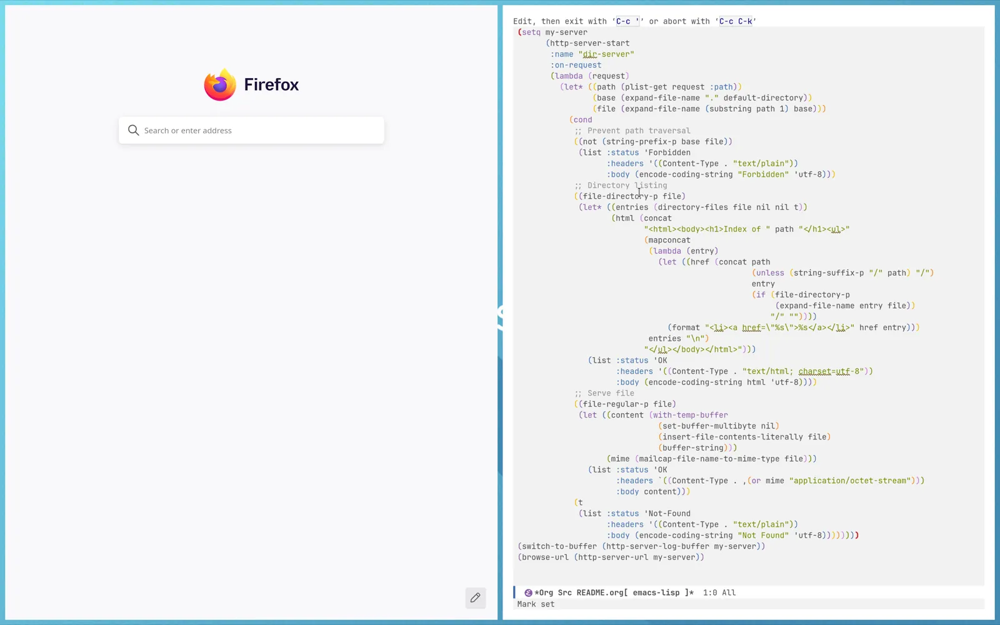
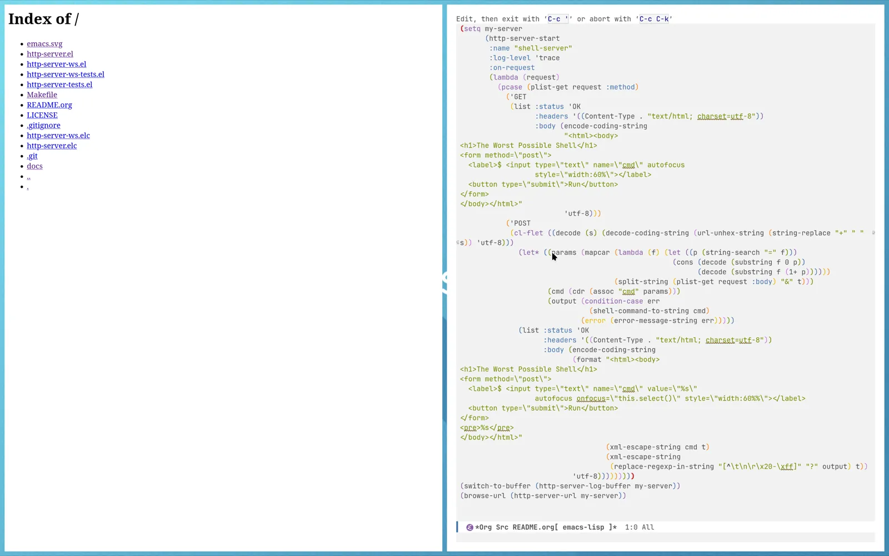
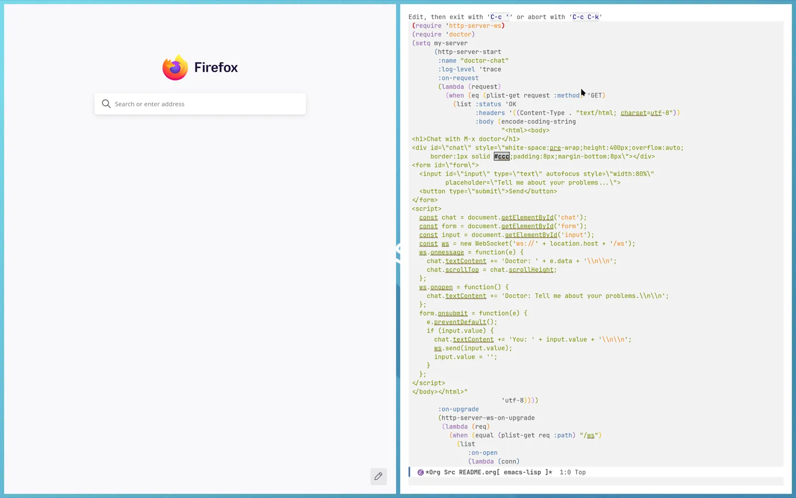
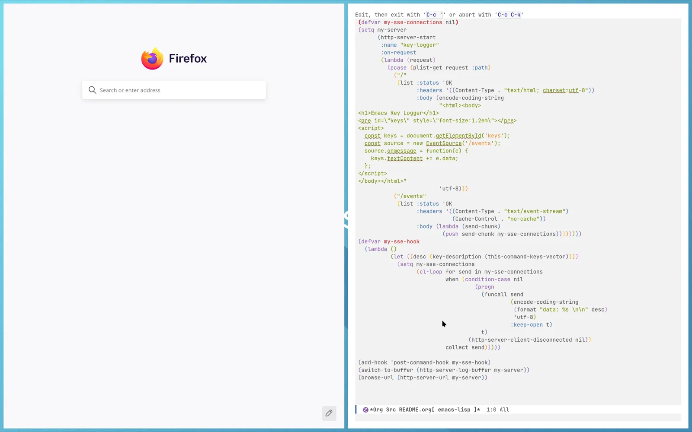

#+title: http-server.el

http-server speaks HTTP for you. It is a building block for other packages that want to offer an HTTP server inside of Emacs to communicate with the user or external programs. http-server's minimal design makes no assumptions on what that package will do with the server. It gets out of your way and grants you full control and responsibility over any aspect of the server that is not directly tied to the HTTP protocol itself.

Conceptually, http-server is similar to Rust's [[https://hyper.rs/][hyper]] or Node.js' [[https://nodejs.org/api/http.html#http][HTTP module]]. To be more precise, http-server
- manages the server socket and client connections,
- parses HTTP requests and converts them into plist structures,
- sends plist-structured responses,
- deals with errors during parsing, handling and sending responses,
- has no global state
- and offers introspection through logging at configurable log levels.
However, http-server is also defined by what it does not do. It does not decode the request body. Instead, it gives you the unibyte string as it arrived in the request. Similarly, it does not decode a query string into a key-value map. Both of these require context knowledge or assumptions which are not part of the HTTP specification and would thus break with http-server's goal of conferring full control and responsibility to the user.

The entry point of this package is ~(http-server-start :on-request REQUEST-HANDLER ...)~, which starts a server socket and begins handing over requests to your request handler immediately. Both *synchronous and asynchronous request handlers* are supported. Beyond this, there is only ~(http-server-stop SERVER)~ to shut down a server and a few utilities to inspect the server. For more details, check out the examples below and read the [[docs/http-server.org][manual online]] or in Emacs with ~M-x info-display-manual RET http-server RET~.

* Examples

The following examples showcase various functionalities of http-server and http-server-ws. For more details, read the [[docs/http-server.org][manual online]] or in Emacs with ~M-x info-display-manual RET http-server RET~.

** Directory serving

Serve the current directory and its files over HTTP.

#+caption: Demo for the directory server

#+begin_src emacs-lisp
  (setq my-server
        (http-server-start
         :name "dir-server"
         :on-request
         (lambda (request)
           (let* ((path (plist-get request :path))
                  (base (expand-file-name "." default-directory))
                  (file (expand-file-name (substring path 1) base)))
             (cond
              ;; Prevent path traversal
              ((not (string-prefix-p base file))
               (list :status 'Forbidden
                     :headers '((Content-Type . "text/plain"))
                     :body (encode-coding-string "Forbidden" 'utf-8)))
              ;; Directory listing
              ((file-directory-p file)
               (let* ((entries (directory-files file nil nil t))
                      (html (concat
                             "<html><body><h1>Index of " path "</h1><ul>"
                             (mapconcat
                              (lambda (entry)
                                (let ((href (concat path
                                                    (unless (string-suffix-p "/" path) "/")
                                                    entry
                                                    (if (file-directory-p
                                                         (expand-file-name entry file))
                                                        "/" ""))))
                                  (format "<li><a href=\"%s\">%s</a></li>" href entry)))
                              entries "\n")
                             "</ul></body></html>")))
                 (list :status 'OK
                       :headers '((Content-Type . "text/html; charset=utf-8"))
                       :body (encode-coding-string html 'utf-8))))
              ;; Serve file
              ((file-regular-p file)
               (let ((content (with-temp-buffer
                                (set-buffer-multibyte nil)
                                (insert-file-contents-literally file)
                                (buffer-string)))
                     (mime (mailcap-file-name-to-mime-type file)))
                 (list :status 'OK
                       :headers `((Content-Type . ,(or mime "application/octet-stream")))
                       :body content)))
              (t
               (list :status 'Not-Found
                     :headers '((Content-Type . "text/plain"))
                     :body (encode-coding-string "Not Found" 'utf-8))))))))
  (switch-to-buffer (http-server-log-buffer my-server))
  (browse-url (http-server-url my-server))
#+end_src

** The worst possible shell

A form that sends post requests to execute commands and display their outputs.

#+caption: Shell demo

#+begin_src emacs-lisp
  (setq my-server
        (http-server-start
         :name "shell-server"
         :log-level 'trace
         :on-request
         (lambda (request)
           (pcase (plist-get request :method)
             ('GET
              (list :status 'OK
                    :headers '((Content-Type . "text/html; charset=utf-8"))
                    :body (encode-coding-string
                           "<html><body>
  <h1>The Worst Possible Shell</h1>
  <form method=\"post\">
    <label>$ <input type=\"text\" name=\"cmd\" autofocus
                    style=\"width:60%\"></label>
    <button type=\"submit\">Run</button>
  </form>
  </body></html>"
                           'utf-8)))
             ('POST
              (cl-flet ((decode (s) (decode-coding-string (url-unhex-string (string-replace "+" " " s)) 'utf-8)))
                (let* ((params (mapcar (lambda (f) (let ((p (string-search "=" f)))
                                                     (cons (decode (substring f 0 p))
                                                           (decode (substring f (1+ p))))))
                                       (split-string (plist-get request :body) "&" t)))
                       (cmd (cdr (assoc "cmd" params)))
                       (output (condition-case err
                                 (shell-command-to-string cmd)
                               (error (error-message-string err)))))
                (list :status 'OK
                      :headers '((Content-Type . "text/html; charset=utf-8"))
                      :body (encode-coding-string
                             (format "<html><body>
  <h1>The Worst Possible Shell</h1>
  <form method=\"post\">
    <label>$ <input type=\"text\" name=\"cmd\" value=\"%s\"
                    autofocus onfocus=\"this.select()\" style=\"width:60%%\"></label>
    <button type=\"submit\">Run</button>
  </form>
  <pre>%s</pre>
  </body></html>"
                                     (xml-escape-string cmd t)
                                     (xml-escape-string
                                      (replace-regexp-in-string "[^\t\n\r\x20-\xff]" "?" output) t))
                             'utf-8)))))))))
  (switch-to-buffer (http-server-log-buffer my-server))
  (browse-url (http-server-url my-server))
#+end_src

** Chat with M-x doctor via WebSocket

A minimal website that allows one to chat with ~M-x doctor~ over a WebSocket.

#+caption: Demo chat with M-x doctor

#+begin_src emacs-lisp
  (require 'http-server-ws)
  (require 'doctor)
  (setq my-server
        (http-server-start
         :name "doctor-chat"
         :log-level 'trace
         :on-request
         (lambda (request)
           (when (eq (plist-get request :method) 'GET)
             (list :status 'OK
                   :headers '((Content-Type . "text/html; charset=utf-8"))
                   :body (encode-coding-string
                          "<html><body>
  <h1>Chat with M-x doctor</h1>
  

  <form id=\"form\">
    <input id=\"input\" type=\"text\" autofocus style=\"width:80%\"
           placeholder=\"Tell me about your problems...\">
    <button type=\"submit\">Send</button>
  </form>
  
  </body></html>"
                          'utf-8))))
         :on-upgrade
         (http-server-ws-on-upgrade
          (lambda (req)
            (when (equal (plist-get req :path) "/ws")
              (list
                 :on-open
                 (lambda (conn)
                   (let ((buf (generate-new-buffer " *doctor-ws*")))
                     (with-current-buffer buf (doctor-mode))
                     (process-put conn :doctor-buffer buf)))
                 :on-message
                 (lambda (conn _type msg)
                   (let ((buf (process-get conn :doctor-buffer)))
                     (with-current-buffer buf
                       (goto-char (point-max))
                       (insert msg "\n")
                       (let* ((doctor-sent (mapcar #'intern (split-string (downcase msg) "[ \t\n]+" t)))
                              (start (point)))
                         (doctor-doc)
                         (let ((reply (string-trim (buffer-substring start (point-max)))))
                           (http-server-ws-send conn 'text reply))))))
                 :on-close
                 (lambda (conn _code _reason)
                   (kill-buffer (process-get conn :doctor-buffer)))))))))
  (switch-to-buffer (http-server-log-buffer my-server))
  (browse-url (http-server-url my-server))
#+end_src

** Emacs key logger with server-sent events

Every keystroke in Emacs appears live in the browser, streamed via server-sent events.

#+caption: Key logger demo

#+begin_src emacs-lisp
  (defvar my-sse-connections nil)
  (setq my-server
        (http-server-start
         :name "key-logger"
         :on-request
         (lambda (request)
           (pcase (plist-get request :path)
             ("/"
              (list :status 'OK
                    :headers '((Content-Type . "text/html; charset=utf-8"))
                    :body (encode-coding-string
                           "<html><body>
  <h1>Emacs Key Logger</h1>
  <pre id=\"keys\" style=\"font-size:1.2em\"></pre>
  
  </body></html>"
                           'utf-8)))
             ("/events"
              (list :status 'OK
                    :headers '((Content-Type . "text/event-stream")
                               (Cache-Control . "no-cache"))
                    :body (lambda (send-chunk)
                            (push send-chunk my-sse-connections))))))))
  (defvar my-sse-hook
    (lambda ()
            (let ((desc (key-description (this-command-keys-vector))))
              (setq my-sse-connections
                    (cl-loop for send in my-sse-connections
                             when (condition-case nil
                                      (progn
                                        (funcall send
                                                 (encode-coding-string
                                                  (format "data: %s \n\n" desc)
                                                  'utf-8)
                                                 :keep-open t)
                                        t)
                                    (http-server-client-disconnected nil))
                             collect send)))))

  (add-hook 'post-command-hook my-sse-hook)
  (switch-to-buffer (http-server-log-buffer my-server))
  (browse-url (http-server-url my-server))
#+end_src

** My IP address

Respond to GET requests with the client's IP address and the current time if the query contains a =time=yes= parameter.

#+begin_src emacs-lisp
  (setq my-server
        (http-server-start
         :host "0.0.0.0"
         :name "my-ip"
         :on-request
         (lambda (request)
           (when (eq (plist-get request :method) 'GET)
             (let* ((conn (plist-get request :connection))
                    (addr (format "%s" (process-contact conn :host)))
                    (query (or (plist-get request :query) ""))
                    (params (url-parse-query-string query))
                    (show-time (equal (cdr (assoc "time" params)) '("yes")))
                    (body (if show-time
                              (format "%s\n%s" addr (format-time-string "%Y-%m-%d %H:%M:%S %Z"))
                            addr)))
               (list :status 'OK
                     :headers '((Content-Type . "text/plain"))
                     :body (encode-coding-string body 'utf-8)))))))
  (browse-url (http-server-url my-server))
#+end_src

** In the wild

The following projects use http-server:
- [[https://codeberg.org/martenlienen/emcp][EMCP]]: An MCP server for Emacs

* HTTP-related RFCs & Specifications

http-server implements a subset of HTTP/1.1 as defined in [[https://www.rfc-editor.org/rfc/rfc9112.html][RFC 9112]] and http-server-ws adds WebSocket support per [[https://www.rfc-editor.org/rfc/rfc6455.html][RFC 6455]].

Supported:

- HTTP methods: GET, HEAD, POST, PUT, DELETE and PATCH (RFC 5789).
- Request bodies: fixed-length (Content-Length) and chunked (Transfer-Encoding: chunked).
- Response bodies: fixed-length (string) and chunked (streaming function).
- Synchronous and asynchronous request handlers.
- Request targets in origin-form (~/path?query~).
- WebSocket upgrade (RFC 6455): opening handshake, text and binary messages, fragmentation reassembly, ping/pong, clean and abnormal close handshake.

Not supported:

- The CONNECT, OPTIONS and TRACE methods. The server responds with ~501 Not Implemented~.
- Request targets in absolute-form, authority-form or asterisk-form, as these are only relevant for proxy servers and the unsupported methods above.
- Header field values outside the visible ASCII range, since non-ASCII header values are an HTTP/1.0 compatibility feature.
- WebSocket extensions (RFC 6455 §9): extension negotiation is not implemented. Extension requests from clients are silently ignored.

* Design Decisions

The following highlights and explains key design decisions behind http-server.

** Capitalized and uppercase symbols

http-server uses symbols like ~GET~ and ~Content-Type~ for the request method and headers. This design encapsulates two decisions: that they are symbols and that the symbols are not all lowercase.

First, they are symbols, because comparing symbols is faster than comparing strings and as a low-level library http-server should be fast wherever possible. This is especially relevant when looking up elements in the ~:headers~ alist.

Second, despite the preference for lowercase symbols in Emacs lisp, http-server keeps the canonical spelling for these symbols, because uppercase HTTP methods and capitalized header names are widely recognized and communicate that these are not arbitrary symbols but relate to HTTP communication. In my experience, this made it easier to follow code in packages that use http-server.

The one wrinkle here is that http-server will only accept methods and headers that are known in advance to prevent attackers from driving the host out of memory by interning unlimited symbols. However, http-server has all standard HTTP methods and headers preconfigured and if you need more, you can pass lists of symbols to ~(http-server-start :extra-methods ... :extra-headers ...)~, so you can implement WebDAV on top of http-server.

** Requests and responses are plists

Plists with symbol/keyword keys are fast and compared to ~cl-defstruct~, they are trivial to inspect in the debugger. Therefore, this decision helps the developer experience.

** Raw queries and bodies

While the query part of URLs almost always follows the ~key=value~ scheme, this is not enforced by any HTTP specification that I know of. Therefore, parsing and thus relying on such a structure would restrict the applicability of http-server unnecessarily. Similarly, when a message body should be en- or decoded and with which coding system is not always clear. While reliable heuristics exist, these belong in a different package, maybe built on top of http-server, as http-server focuses on the part of request decoding and response encoding that is absolutely always correct.

** No global state

All server state is kept in either the server process or client process plists. This ensures that any number of http-server servers can coexist created by unrelated projects without interfering or having to know about one another. In particular, the servers can be started and stopped at any point without requiring coordination. The one exception is ~http-server-log-level~ for developer convenience, though it is only a fallback value and any server can disconnect from this global fallback by passing ~:log-level~ explicitly to ~http-server-start~.

* Development

- ~make test~ runs the test suite
- ~make docs~ compiles the info page from the manual
